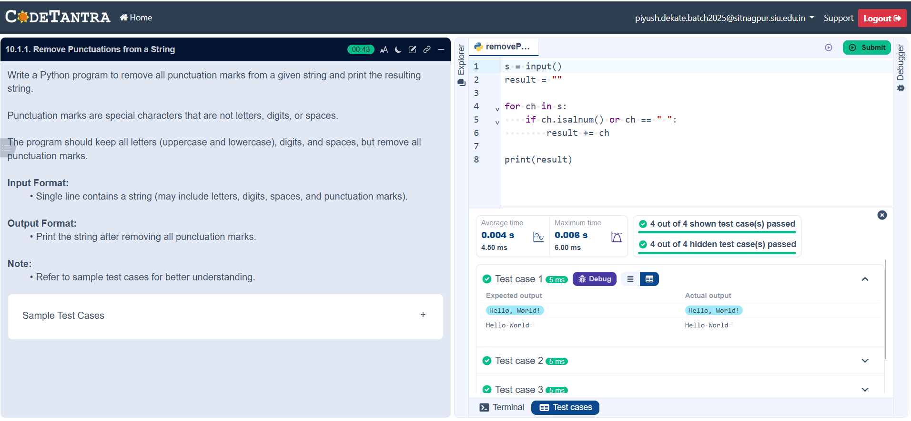

## Problem Statement
Write a Python program to remove all punctuation marks from a given string and print the resulting string.

---

## Algorithm
1.Start

2.Input the string
   Read a string from the user and store it in a variable X.

3.Initialize a new string
   Create an empty string Y = "" to store the result after removing punctuation.

4.Traverse the string
   Take each character i from the string X one by one using a loop.

5.Check character type
   For each character i, check:

6.If it is a letter (A–Z or a–z)
   OR a digit (0–9)
   OR a space

7.Condition check
   If the character satisfies the above condition , then:
   Append the character i to string Y
   Otherwise ignore it

8.Repeat the process
   Continue steps 4–6 until all characters of the string X are processed.

9.Display the result
   Print the final string Y which contains no punctuation marks.

10.Stop

---

## Flowchart

---

## Execution

  

