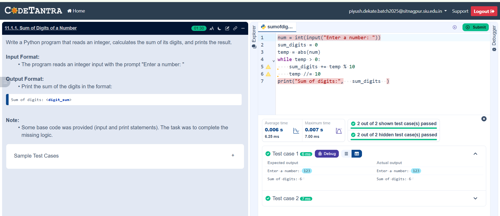

## Problem Statement
Write a Python program that reads an integer, calculates the sum of its digits, and prints the result.

---

## Algorithm
Step 1: Start

Step 2: Input an integer and store it in num

Step 3: Set sum to 0

Step 4: Repeat steps 5 through 7 while num is greater than 0

Step 5: Find the last digit using the modulo operator: digit = num % 10

Step 6: Add the digit to the current sum

Step 7: Remove the last digit using integer division: num = num // 10

Step 8: Go back to Step 4

Step 9: Once num becomes 0, exit the loop

Step 10: Print the final value of sum

Step 11: Stop

---

## Flowchart

---

## Execution

  

