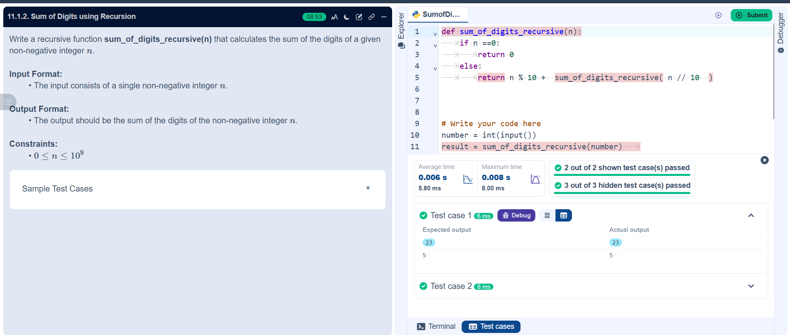

## Problem Statement
Write a recursive function sum_of_digits_recursive(n) that calculates the sum of the digits of a given non-negative integer 

---

## Algorithm:

Step 1: Start

Step 2: Input an integer n

Step 3: Call function sum (n)

Step 4: If n == 0, return 0

Step 5: Else compute:

a) r = n% 10 (last digit)

b) q = n // 10 (remaining number)

Step 6: Return r + sum (q)

Step 7: Print the result

Step 8: Stop

---

## Flowchart

---

## Execution

  

